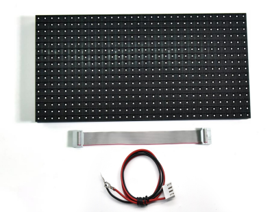
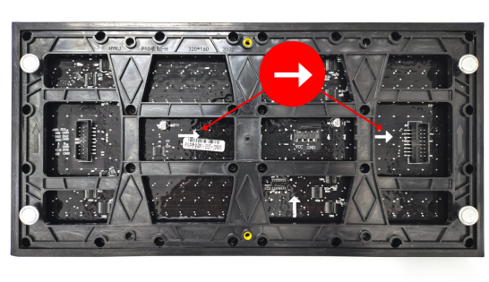
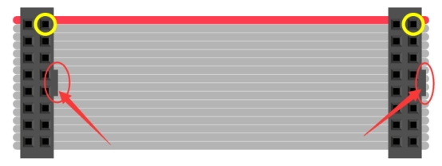
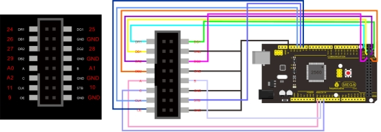
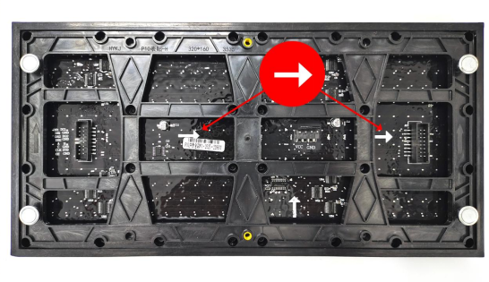
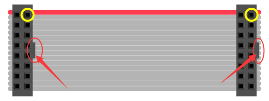
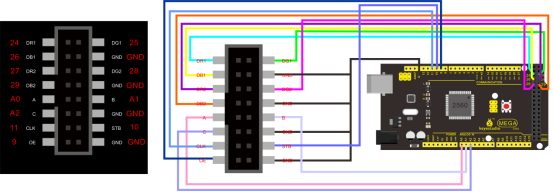
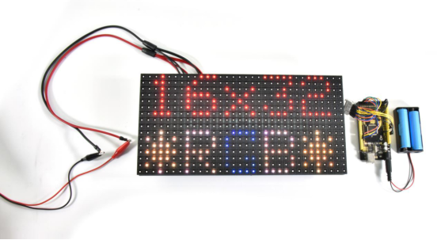

# KT0186 P10 16x32全彩LED显示模块

# KT0186 P10 16x32 Full Color LED Display Module



## Chinese Tutorial

### 1.介绍

广告牌是一种传递信息的户外媒体，我们的P10 32*16全彩LED矩阵便是广告牌主要的成员，可以由多个P10 32*16 LED矩阵组成一个更大的广告牌。P10 32*16全彩LED矩阵由512个RGB灯珠组成32*16的矩阵，可以混合出各种颜色的文字。

### 2.参数

| LED 封装：SMD                     | 工作：-10℃~+60℃           |
| --------------------------------- | ------------------------- |
| 结构特点：灯驱合一                | 相对湿度：10%～95%RH      |
| 全彩色：红色+绿色+蓝色            | 可视距离：5-101           |
| 单点象素组合：1R1G1B              | 使用环境：室外            |
| 物理密度：10000点/m2              | 平均无故障时间：1万个小时 |
| 物理点间距：10mm                  | 使用寿命：7.5万~10万小时  |
| 发光点颜色：1R1G1B                | 平均无故障时间：1万个小时 |
| 驱动方式：恒流                    | 开关电源负荷：5V/40A      |
| 扫描方式：1/4扫                   | 工作电压： 220V± 10%      |
| 单元板分辨率：32点×16点=512点/pcs | 输入电压：4.8～5.5v       |
| 单元板尺寸：320mm×160mm           | 平均功耗：250W/m2         |
| 白平衡亮度：>4500cd/m2            | 最大功耗：<500w/m         |
| 模组数据接口：HUB-08              | 平 整度：模块间拼逢<1mm   |
| 环境温度：存贮-20℃~+80℃           | 单元板重量：约 350g       |

### 3.接线图

如何判断数据输入输出口，忽略垂直箭头（上下的箭头），看水平箭头（左右方向的箭头），水平箭头表示数据输入到数据输出的方向，由此就可以判断出输入端的接口。
如下图，水平箭头是指向右边的，那就证明数据是从左边输入右边输出的，那左边的便是输入接口了。



以排线接头凸起点为参照物（红色圈部分），黄色圈的两个点是导通的。



将排线接入左侧图中接口，然后使用面包线连接排线和MEGA 2560开发板，接线位置参照右图。



### 4.代码

下载：[](./code.7z)

```c
#include <RGBmatrixPanel.h>
#define CLK 11 // USE THIS ON ARDUINO MEGA
#define OE   9
#define LAT 10
#define A   A0
#define B   A1
#define C   A2
RGBmatrixPanel matrix(A, B, C, CLK, LAT, OE, false);
void setup() {

  matrix.begin();

  // draw a pixel in white
  matrix.drawPixel(0, 0, matrix.Color333(7, 7, 7));
  delay(500);

  // fix the screen with green
  matrix.fillRect(0, 0, 32, 16, matrix.Color333(0, 7, 0));
  delay(500);

  // draw a box in yellow
  matrix.drawRect(0, 0, 32, 16, matrix.Color333(7, 7, 0));
  delay(500);

  // draw an 'X' in red
  matrix.drawLine(0, 0, 31, 15, matrix.Color333(7, 0, 0));
  matrix.drawLine(31, 0, 0, 15, matrix.Color333(7, 0, 0));
  delay(500);

  // draw a blue circle
  matrix.drawCircle(7, 7, 7, matrix.Color333(0, 0, 7));
  delay(500);

  // fill a violet circle
  matrix.fillCircle(23, 7, 7, matrix.Color333(7, 0, 7));
  delay(500);

  // fill the screen with black
  matrix.fillScreen(matrix.Color333(0, 0, 0));

  // draw some text!
  matrix.setCursor(1, 0);  // start at top left, with one pixel of spacing
  matrix.setTextSize(1);   // size 1 == 8 pixels high

  // print each letter with a rainbow color
  matrix.setTextColor(matrix.Color333(7, 0, 0));
  matrix.print('k');
  matrix.setTextColor(matrix.Color333(7, 4, 0));
  matrix.print('e');
  matrix.setTextColor(matrix.Color333(7, 7, 0));
  matrix.print('y');
  matrix.setTextColor(matrix.Color333(4, 7, 0));
  matrix.print('e');
  matrix.setTextColor(matrix.Color333(0, 7, 0));
  matrix.print('s');

  matrix.setCursor(1, 9);  // next line
  matrix.setTextColor(matrix.Color333(0, 7, 7));
  matrix.print('h');
  matrix.setTextColor(matrix.Color333(0, 4, 7));
  matrix.print('e');
  matrix.setTextColor(matrix.Color333(0, 0, 7));
  matrix.print('l');
  matrix.setTextColor(matrix.Color333(4, 0, 7));
  matrix.print('l');
  matrix.setTextColor(matrix.Color333(7, 0, 4));
  matrix.print('o');

  // whew!
}

void loop() {
  // Do nothing -- image doesn't change
}
```

### 5.现象


## English Tutorial

### 1.Introduction

Billboard is an outdoor media that transmits information. The P10 32*16 full-color LED matrix is one of billboards.
It can form into a larger billboard. It is composed of 512 RGB lamp beads, which can produce text of various colors.

### 2.Parameters

| LED sealed package：SMD                             | Working temperature：-10℃~+60℃      |
| --------------------------------------------------- | ----------------------------------- |
| Structural features：light +driver                  | Relative humidity：10%～95%RH       |
| Full color：red+green+blue                          | Visible distance：5-101             |
| Single pixel combination：1R1G1B                    | Application：outdoor                |
| Physical density：10000点/m2                        | Normal working time：10,000 hours   |
| Physical point spacing：10mm                        | Life span：75000~100000 hours       |
| Glowing point color：1R1G1B                         | Average working time：10000 hours   |
| Driving way：constant current                       | Switching power supply load：5V/40A |
| Scanning method：1/4扫                              | Operating Voltage： 220V± 10%       |
| Cell board resolution：32 dot ×16 dot =512 dot /pcs | Input voltage：4.8～5.5v            |
| Cell board size：320mm×160mm                        | Average power consumption：250W/m2  |
| White balance brightness：>4500cd/m2                | Max power consumption：<500w/m      |
| Module data interface：HUB-08                       | Flatness：gaps of modules<1mm       |
| Ambient temperature：storage 20℃~+80℃               | Cell board weight：around 350g      |

### 3.Connection Diagram

How to determine data input/output ports?
Ignore vertical arrows(up and down arrows), view horizontal arrows(left and right arrows). Horizontal arrows imply the direction of data input to data output. In this way, you can determine the port of inputs
As you can see horizontal arrows below point at the right side. That means data coming from the left to the right. So, the left is the input port.



Take the raised point of the cable connector as a reference(red circles).
Interfaces marked by yellow circles are connected.



Connect flat cables to the left port, then wire the MEGA 2560 board and flat cables using breadboard wires, as shown below;



### 4.Test Code

downlosds:[](./code.7z)

```c
#include <RGBmatrixPanel.h>

#define CLK 11 // USE THIS ON ARDUINO MEGA
#define OE   9
#define LAT 10
#define A   A0
#define B   A1
#define C   A2

RGBmatrixPanel matrix(A, B, C, CLK, LAT, OE, false);

void setup() {

  matrix.begin();

  // draw a pixel in white
  matrix.drawPixel(0, 0, matrix.Color333(7, 7, 7));
  delay(500);

  // fix the screen with green
  matrix.fillRect(0, 0, 32, 16, matrix.Color333(0, 7, 0));
  delay(500);

  // draw a box in yellow
  matrix.drawRect(0, 0, 32, 16, matrix.Color333(7, 7, 0));
  delay(500);

  // draw an 'X' in red
  matrix.drawLine(0, 0, 31, 15, matrix.Color333(7, 0, 0));
  matrix.drawLine(31, 0, 0, 15, matrix.Color333(7, 0, 0));
  delay(500);

  // draw a blue circle
  matrix.drawCircle(7, 7, 7, matrix.Color333(0, 0, 7));
  delay(500);

  // fill a violet circle
  matrix.fillCircle(23, 7, 7, matrix.Color333(7, 0, 7));
  delay(500);

  // fill the screen with black
  matrix.fillScreen(matrix.Color333(0, 0, 0));

  // draw some text!
  matrix.setCursor(1, 0);  // start at top left, with one pixel of spacing
  matrix.setTextSize(1);   // size 1 == 8 pixels high

  // print each letter with a rainbow color
  matrix.setTextColor(matrix.Color333(7, 0, 0));
  matrix.print('k');
  matrix.setTextColor(matrix.Color333(7, 4, 0));
  matrix.print('e');
  matrix.setTextColor(matrix.Color333(7, 7, 0));
  matrix.print('y');
  matrix.setTextColor(matrix.Color333(4, 7, 0));
  matrix.print('e');
  matrix.setTextColor(matrix.Color333(0, 7, 0));
  matrix.print('s');

  matrix.setCursor(1, 9);  // next line
  matrix.setTextColor(matrix.Color333(0, 7, 7));
  matrix.print('h');
  matrix.setTextColor(matrix.Color333(0, 4, 7));
  matrix.print('e');
  matrix.setTextColor(matrix.Color333(0, 0, 7));
  matrix.print('l');
  matrix.setTextColor(matrix.Color333(4, 0, 7));
  matrix.print('l');
  matrix.setTextColor(matrix.Color333(7, 0, 4));
  matrix.print('o');

  // whew!
}

void loop() {
  // Do nothing -- image doesn't change
}
```

### 5.Test Result

